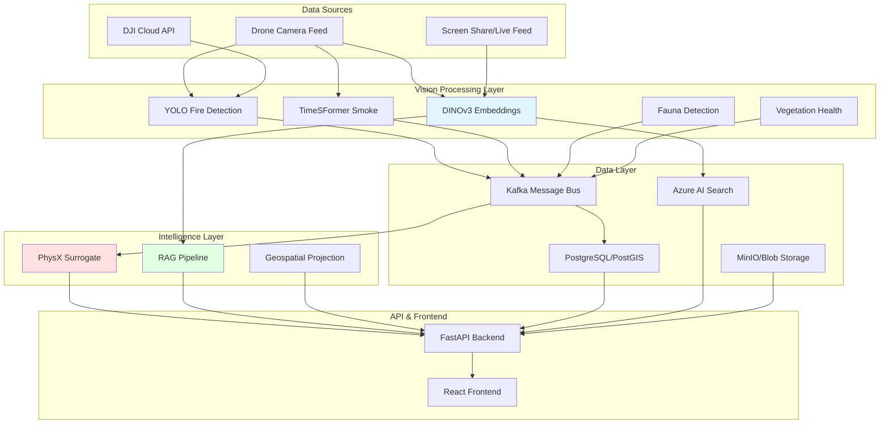
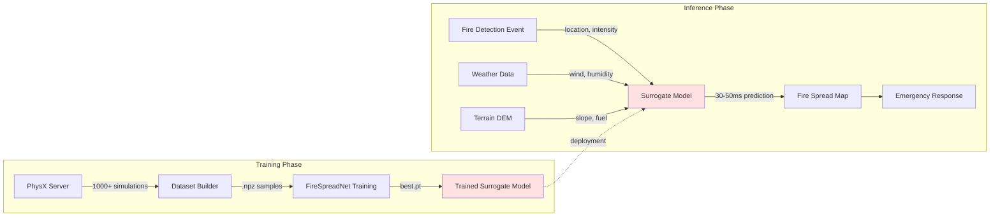
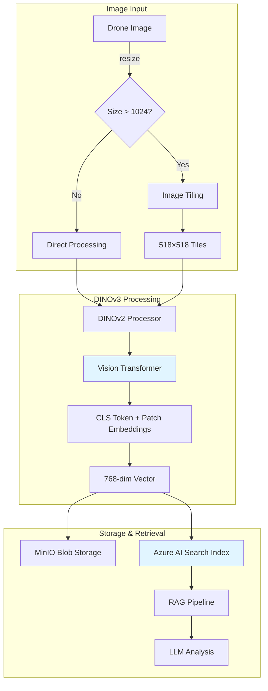
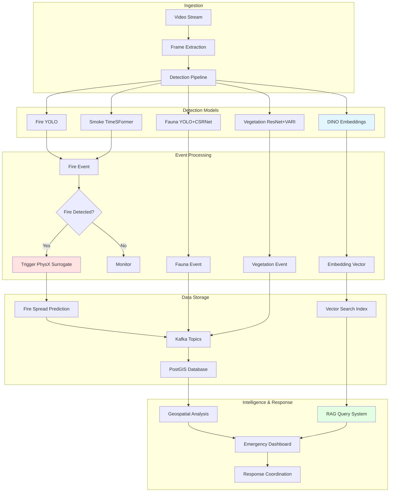
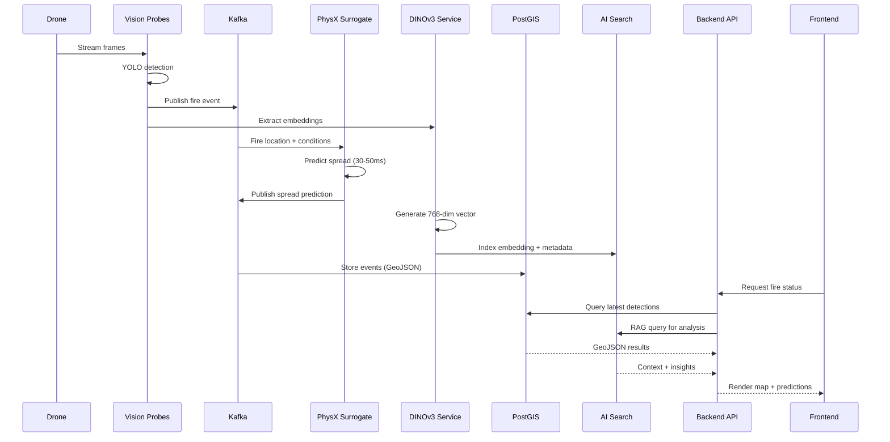
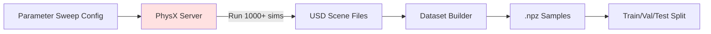
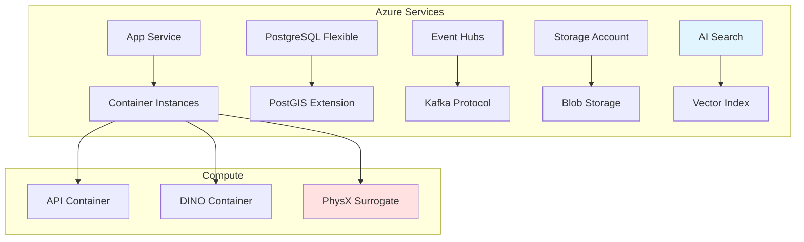

# GUIRA Fire Detection System Architecture

## Table of Contents
- [System Overview](#system-overview)
- [Architecture Diagrams](#architecture-diagrams)
- [Core Components](#core-components)
- [PhysX Integration](#physx-integration)
- [DINO v3 Integration](#dino-v3-integration)
- [Data Flow](#data-flow)
- [Deployment Architecture](#deployment-architecture)

---

## System Overview

GUIRA (Geospatial Understanding & Intelligence for Rapid Assessment) is an advanced wildfire detection and prevention system that integrates:

1. **AI-powered detection models** - YOLOv8, TimeSFormer, ResNet50, CSRNet
2. **PhysX fire spread simulation** - Physics-based predictive modeling with neural surrogate
3. **DINOv3 vision embeddings** - Self-supervised visual feature extraction for RAG pipelines
4. **Geospatial processing** - Real-time projection and mapping
5. **Real-time data ingestion** - Stream processing with Kafka and PostgreSQL/PostGIS

The system processes drone imagery, detects fires and environmental conditions, simulates fire spread, and provides actionable intelligence for emergency response.

---

## Architecture Diagrams

### 1. High-Level System Architecture



### 2. PhysX Fire Spread Integration



**Flow Description:**
1. **Training:** PhysX server generates synthetic fire scenarios with varying parameters (wind, fuel, humidity)
2. **Dataset Creation:** Each simulation produces time-series snapshots saved as .npz files
3. **Model Training:** FireSpreadNet (U-Net) learns to predict fire evolution from environmental inputs
4. **Deployment:** Trained model provides 100-1000× faster predictions than PhysX for real-time response

### 3. DINO v3 Vision Embedding Pipeline



**Key Features:**
- **Model:** facebook/dinov2-base (768-dim) or dinov2-large (1024-dim)
- **Tiling:** Large images split into 518×518 patches with 50% overlap
- **Speed:** <500ms per image on GPU
- **Use Cases:** Scene understanding, anomaly detection, visual search, RAG

### 4. Complete Data Flow Architecture



### 5. Component Interaction Diagram



---

## Core Components

### 1. Vision Probes

| Component | Technology | Purpose | Location |
|-----------|-----------|---------|----------|
| **YOLO Fire Probe** | YOLOv8 | Fire & smoke detection | `integrations/guira_core/vision/probes/yolo_probe/` |
| **TimeSFormer Probe** | Vision Transformer | Temporal smoke analysis | `integrations/guira_core/vision/probes/timesformer_probe/` |
| **DINO Embedding Service** | DINOv2 ViT | Visual feature extraction | `integrations/guira_core/vision/embed_service/` |

**YOLO Fire Probe Architecture:**
- Backbone: CSPDarknet with PANet
- Classes: fire (0), smoke (1)
- Input: 640×640 RGB images
- Output: Bounding boxes + confidence scores

**TimeSFormer Probe Architecture:**
- Input: 8-frame sequences (224×224)
- Attention: Divided space-time attention
- Output: Binary smoke classification

**DINO Embedding Service:**
- Model: facebook/dinov2-base (768-dim) or dinov2-large (1024-dim)
- Processing: Automatic tiling for large images
- API: FastAPI endpoint at `/embed`

### 2. PhysX Fire Spread System

| Component | Purpose | Location |
|-----------|---------|----------|
| **PhysX Server** | C++ physics simulation | `integrations/guira_core/simulation/physx_server/` |
| **Dataset Builder** | Generate training data | `integrations/guira_core/orchestrator/surrogate/dataset_builder.py` |
| **FireSpreadNet** | Neural surrogate model | `integrations/guira_core/orchestrator/surrogate/models.py` |
| **Training Pipeline** | MLflow-tracked training | `integrations/guira_core/orchestrator/surrogate/train.py` |
| **Inference API** | Real-time predictions | `integrations/guira_core/orchestrator/api/app.py` |

**FireSpreadNet Architecture (U-Net):**
```
Input: (B, 6, H, W) → [fire_t0, wind_u, wind_v, humidity, fuel, slope]
Encoder: 4 levels (32→64→128→256 filters) with MaxPool
Bottleneck: 512 filters
Decoder: 4 levels with skip connections + TransposeConv
Output Heads:
  - Ignition probability: (B, 1, H, W) [0-1] via sigmoid
  - Fire intensity: (B, 1, H, W) [0+] via ReLU
```

**Performance:**
- Training: 50 epochs, ~2-4 hours on GPU
- Inference: 30-50ms (100-1000× faster than PhysX)
- Accuracy: ~95% vs PhysX ground truth

### 3. Data Ingestion & Storage

| Component | Technology | Purpose |
|-----------|-----------|---------|
| **Kafka Message Bus** | Apache Kafka | Event streaming | 
| **PostGIS Database** | PostgreSQL + PostGIS | Geospatial storage |
| **Azure AI Search** | Vector search | Embedding indexing |
| **MinIO** | Object storage | Blob storage |

**Kafka Topics:**
- `fire_detections` - Fire/smoke events from YOLO
- `fauna_observations` - Wildlife detections
- `vegetation_health` - Vegetation assessments
- `fire_spread_predictions` - PhysX surrogate outputs
- `embeddings` - DINO vector metadata

### 4. Backend API

**Technology:** FastAPI (async Python web framework)

**Key Endpoints:**
- `POST /api/ingest/detection` - Receive detection events
- `POST /api/surrogate/predict` - Request fire spread prediction
- `POST /api/embed` - Generate DINO embeddings
- `GET /api/query` - RAG-based query system
- `GET /api/map/fires` - GeoJSON fire locations

**Location:** `integrations/guira_core/orchestrator/api/app.py`

### 5. Frontend Dashboard

**Technology:** React + TypeScript + Vite

**Features:**
- Real-time fire map (Leaflet/Mapbox)
- Fire spread visualization
- Detection timeline
- RAG-powered chat interface
- System health monitoring

**Location:** `integrations/guira_core/frontend/`

---

## PhysX Integration

### Training Data Generation



**Parameter Ranges:**
- Wind speed: 0-20 m/s (log-normal distribution)
- Wind direction: 0-360° (uniform)
- Fuel moisture: 0-1 (beta distribution)
- Humidity: 0.1-0.9 (normal, μ=0.4)
- Temperature: 10-45°C (normal, μ=25)

### Surrogate Model Training

**Loss Function:**
```
L_total = λ_BCE × L_BCE + λ_MSE × L_MSE + λ_Brier × L_Brier

Where:
  L_BCE    = Binary cross-entropy for ignition probability
  L_MSE    = Mean squared error for fire intensity
  L_Brier  = Brier score for probabilistic calibration
  λ_BCE = 1.0, λ_MSE = 1.0, λ_Brier = 0.5
```

**Training Command:**
```bash
cd integrations/guira_core/orchestrator/surrogate
python train.py \
    --data-dir physx_dataset \
    --epochs 50 \
    --batch-size 8 \
    --lr 1e-3 \
    --exp-name physx-surrogate \
    --model-type full
```

**Evaluation Metrics:**
- MSE (intensity): Target < 0.05, Acceptable < 0.10
- BCE (ignition): Target < 0.3, Acceptable < 0.5
- Brier score: Target < 0.15, Acceptable < 0.25
- IoU (ignition): Target > 0.7, Acceptable > 0.5

### Real-time Inference

**API Usage:**
```python
from integrations.guira_core.orchestrator.surrogate import PhysXSurrogate

surrogate = PhysXSurrogate(model_path="models/fire_spreadnet.pt")

# Input: fire state + environmental conditions
prediction = surrogate.predict_fire_spread(
    fire_t0=fire_mask,      # (H, W) current fire state
    wind_u=wind_u_grid,     # (H, W) wind u-component
    wind_v=wind_v_grid,     # (H, W) wind v-component
    humidity=humidity_grid, # (H, W) relative humidity
    fuel=fuel_grid,         # (H, W) fuel density
    slope=slope_grid        # (H, W) terrain slope
)

# Output: ignition probability + intensity
ignition_prob = prediction['ignition']  # (H, W) [0-1]
intensity = prediction['intensity']      # (H, W) [0+]
```

---

## DINO v3 Integration

### Embedding Extraction

**Model Specifications:**
- **Base Model:** facebook/dinov2-base (ViT-Base/14)
- **Embedding Dimension:** 768 (base) or 1024 (large)
- **Input Size:** 518×518 (optimal for DINOv2)
- **Tiling Strategy:** 50% overlap for images > 1024×1024

**API Endpoint:**
```bash
curl -X POST http://localhost:8002/embed \
  -F "file=@drone_image.jpg" \
  -F "store=true" \
  -F "metadata={\"session_id\": \"session_123\"}"
```

**Response:**
```json
{
  "embedding_id": "uuid-here",
  "shape": [768],
  "num_tiles": 4,
  "blob_url": "s3://embeds/uuid.npy",
  "indexed": true
}
```

### Integration with RAG Pipeline


**Use Cases:**
1. **Visual Search:** "Find all images with active fires near water sources"
2. **Anomaly Detection:** "Identify unusual smoke patterns"
3. **Contextual Analysis:** "Describe fire progression over time"
4. **Scene Understanding:** "What vegetation is near the fire perimeter?"

### Storage Architecture

**MinIO Blob Storage:**
- Embeddings stored as `.npy` files (NumPy format)
- Organized by session_id and timestamp
- Accessible via pre-signed URLs

**Azure AI Search Index:**
- Vector field: 768-dim float array
- Metadata fields: session_id, timestamp, location (lat/lon), detection_types
- Hybrid search: vector similarity + metadata filters

---

## Data Flow

### 1. Ingestion Flow

```
Drone → Frame Extraction → Detection Models → Kafka → PostGIS
                                ↓
                         DINO Embeddings → Azure AI Search
```

### 2. Fire Detection Flow

```
Fire Detected → Kafka Event → PhysX Surrogate → Spread Prediction → PostGIS
                                                        ↓
                                                  Emergency Alert
```

### 3. RAG Query Flow

```
User Query → Query Embedding → Vector Search → Context Retrieval → LLM → Response
```

---

## Deployment Architecture

### Local Development

```yaml
Services:
  - PostgreSQL + PostGIS (port 5432)
  - Kafka + Zookeeper (port 9092)
  - MinIO (port 9000)
  - Backend API (port 8000)
  - DINO Embed Service (port 8002)
  - Frontend (port 5173)
```

**Start Command:**
```bash
cd integrations/guira_core/infra
./local_start.sh
```

### Cloud Deployment (Azure)



**Bicep Deployment:**
```bash
cd integrations/guira_core/infra/bicep
az deployment group create \
  --resource-group guira-rg \
  --template-file guira_infra.bicep \
  --parameters @params.json
```

### Kubernetes Deployment

**Namespaces:**
- `guira-vision` - Vision probes and DINO service
- `guira-orchestrator` - API and PhysX surrogate
- `guira-data` - Kafka, PostgreSQL, MinIO

**Helm Charts:** Available in `integrations/guira_core/infra/k8s/`

---

## Performance Characteristics

| Component | Latency | Throughput | Resource Requirements |
|-----------|---------|------------|----------------------|
| YOLO Fire Detection | 30-50ms | 20-30 FPS | 2GB GPU VRAM |
| TimeSFormer Smoke | 100-150ms | 6-10 FPS | 4GB GPU VRAM |
| DINO Embedding | <500ms | 2-5 images/sec | 4GB GPU VRAM |
| PhysX Surrogate | 30-50ms | 20-30 predictions/sec | 2GB GPU VRAM |
| Full PhysX Sim | 5-50 seconds | 0.02-0.2 sims/sec | 8GB RAM |

---

## Security & Compliance

- **Authentication:** JWT tokens for API access
- **Data Encryption:** TLS 1.3 in transit, AES-256 at rest
- **Privacy:** Face masking and PII redaction options
- **Audit Logging:** All API calls logged with user_id and timestamps
- **Compliance:** GDPR-compliant data retention (90-day default)

---

## Monitoring & Observability

- **Metrics:** Prometheus + Grafana dashboards
- **Logging:** Structured JSON logs with trace_id
- **Tracing:** OpenTelemetry distributed tracing
- **Alerts:** Fire detection events, system health, API latency

---

## References

- [Functionality_PhysX_DINOv3.md](./Functionality_PhysX_DINOv3.md) - Detailed technical specifications
- [PROJECT_OVERVIEW.md](./PROJECT_OVERVIEW.md) - System overview and capabilities
- [TECHNICAL_ALGORITHMS_GUIDE.md](./TECHNICAL_ALGORITHMS_GUIDE.md) - Algorithm deep-dives
- [Integration README](./integrations/guira_core/README.md) - Integration setup guide
