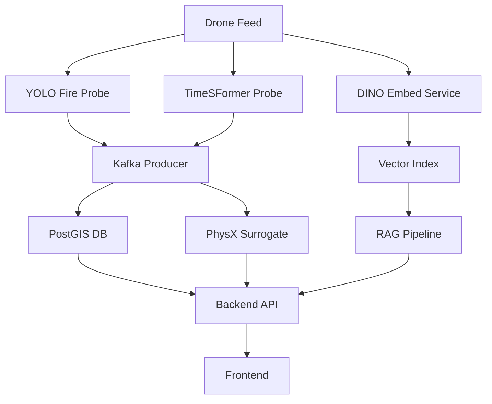

# GUIRA Component Reference

## Table of Contents
- [Overview](#overview)
- [PhysX Fire Spread Components](#physx-fire-spread-components)
- [DINO v3 Vision Components](#dino-v3-vision-components)
- [Detection Models](#detection-models)
- [Data Ingestion Components](#data-ingestion-components)
- [API Components](#api-components)
- [Utility Components](#utility-components)

---

## Overview

This document provides detailed reference information for all major components in the GUIRA fire detection system, with a focus on PhysX and DINO v3 integrations.

---

## PhysX Fire Spread Components

### 1. PhysX Server (`integrations/guira_core/simulation/physx_server/`)

**Purpose:** C++ physics simulation server for generating fire spread training data

**Technology Stack:**
- NVIDIA PhysX SDK 5.x
- gRPC for remote procedure calls
- Protocol Buffers for data serialization
- CMake build system

**Key Files:**
```
physx_server/
├── CMakeLists.txt          # Build configuration
├── Dockerfile              # Container build
├── physx_server.cpp        # Main server implementation
├── fire_simulation.cpp     # Fire spread physics logic
├── proto/
│   └── physx.proto        # gRPC service definition
└── physx_client.py        # Python client wrapper
```

**API Methods:**
```protobuf
service PhysXSimulation {
  // Run single fire spread simulation
  rpc RunSimulation(SimulationRequest) returns (SimulationResponse);
  
  // Run batch of simulations with parameter sweeps
  rpc RunEnsemble(EnsembleRequest) returns (stream SimulationResponse);
}
```

**Usage:**
```python
from physx_client import PhysXClient

client = PhysXClient(server_address="localhost:50051")

# Run single simulation
result = client.run_simulation(
    grid_size=64,
    timesteps=10,
    wind_speed=5.0,
    wind_direction=45.0,
    humidity=0.3,
    fuel_density=0.8
)

# Access results
fire_evolution = result['fire_states']  # List of (H, W) grids
```

**Build Instructions:**
```bash
cd integrations/guira_core/simulation/physx_server

# Install dependencies
sudo apt-get install -y libphysx-dev libgrpc++-dev protobuf-compiler

# Build
mkdir build && cd build
cmake ..
make -j8

# Run
./physx_server --port 50051
```

---

### 2. Dataset Builder (`integrations/guira_core/orchestrator/surrogate/dataset_builder.py`)

**Purpose:** Convert PhysX simulation outputs into training-ready .npz files

**Input:** PhysX simulation results (USD files or raw arrays)

**Output:** Structured .npz samples with train/val/test splits

**Key Functions:**

#### `build_dataset()`
```python
def build_dataset(
    input_dir: str,           # PhysX simulation directory
    output_dir: str,          # Output dataset directory
    grid_size: int = 64,      # Resample to this grid size
    split_ratios: Tuple[float, float, float] = (0.7, 0.15, 0.15)
) -> Dict[str, Any]:
    """
    Build training dataset from PhysX simulations.
    
    Returns:
        {
            'num_samples': int,
            'splits': {'train': int, 'val': int, 'test': int},
            'dataset_info': {...}
        }
    """
```

**Sample Format:**
```python
# Each .npz file contains:
{
    'input': np.ndarray,          # (6, H, W) - fire_t0, wind_u, wind_v, humidity, fuel, slope
    'target_ignition': np.ndarray, # (H, W) - binary ignition at t+1
    'target_intensity': np.ndarray # (H, W) - fire intensity at t+1
}
```

**Usage:**
```bash
python dataset_builder.py \
    --input-dir physx_simulations/ \
    --output-dir physx_dataset/ \
    --grid-size 64 \
    --split-ratio 0.7 0.15 0.15
```

---

### 3. FireSpreadNet Model (`integrations/guira_core/orchestrator/surrogate/models.py`)

**Purpose:** Neural surrogate model for real-time fire spread prediction

**Architecture:** U-Net encoder-decoder with skip connections

**Implementation:**
```python
class FireSpreadNet(nn.Module):
    """
    U-Net architecture for fire spread prediction.
    
    Args:
        in_channels (int): Number of input channels (default=6)
        base_filters (int): Base filter count (default=32)
        num_levels (int): Encoder/decoder depth (default=4)
    """
    
    def __init__(self, in_channels=6, base_filters=32, num_levels=4):
        super().__init__()
        
        # Encoder
        self.encoders = nn.ModuleList([
            self._make_encoder_block(
                in_channels if i == 0 else base_filters * (2 ** (i-1)),
                base_filters * (2 ** i)
            )
            for i in range(num_levels)
        ])
        
        # Bottleneck
        self.bottleneck = nn.Sequential(
            nn.Conv2d(base_filters * (2 ** (num_levels-1)), 
                     base_filters * (2 ** num_levels), 3, padding=1),
            nn.BatchNorm2d(base_filters * (2 ** num_levels)),
            nn.ReLU(inplace=True)
        )
        
        # Decoder
        self.decoders = nn.ModuleList([
            self._make_decoder_block(
                base_filters * (2 ** (i+1)) + base_filters * (2 ** i),
                base_filters * (2 ** i)
            )
            for i in range(num_levels-1, -1, -1)
        ])
        
        # Output heads
        self.ignition_head = nn.Sequential(
            nn.Conv2d(base_filters, 1, 1),
            nn.Sigmoid()
        )
        
        self.intensity_head = nn.Sequential(
            nn.Conv2d(base_filters, 1, 1),
            nn.ReLU()
        )
    
    def forward(self, x):
        """
        Args:
            x: (B, 6, H, W) - input raster stack
        
        Returns:
            {
                'ignition': (B, 1, H, W) - ignition probability [0-1]
                'intensity': (B, 1, H, W) - fire intensity [0+]
            }
        """
        # Encoder with skip connections
        skip_connections = []
        for encoder in self.encoders:
            x = encoder(x)
            skip_connections.append(x)
            x = F.max_pool2d(x, 2)
        
        # Bottleneck
        x = self.bottleneck(x)
        
        # Decoder with skip connections
        for i, decoder in enumerate(self.decoders):
            x = F.interpolate(x, scale_factor=2, mode='bilinear')
            skip = skip_connections[-(i+1)]
            x = torch.cat([x, skip], dim=1)
            x = decoder(x)
        
        # Output heads
        ignition = self.ignition_head(x)
        intensity = self.intensity_head(x)
        
        return {'ignition': ignition, 'intensity': intensity}
```

**Model Variants:**

| Variant | Parameters | GPU Memory | Inference Time |
|---------|------------|------------|----------------|
| **FireSpreadNetFull** | 1.2M | 4GB | 30-50ms |
| **FireSpreadNetLite** | 300K | 2GB | 20-30ms |

---

### 4. Training Pipeline (`integrations/guira_core/orchestrator/surrogate/train.py`)

**Purpose:** MLflow-tracked training for FireSpreadNet

**Key Features:**
- Automatic mixed precision training
- Learning rate scheduling (ReduceLROnPlateau)
- Model checkpointing (best validation loss)
- MLflow experiment tracking

**Training Script:**
```python
python train.py \
    --data-dir physx_dataset \
    --epochs 50 \
    --batch-size 8 \
    --lr 1e-3 \
    --exp-name physx-surrogate \
    --model-type full \
    --save-dir models \
    --mlflow-uri http://localhost:5000
```

**Logged Metrics:**
- Training loss (BCE + MSE + Brier)
- Validation loss
- Per-component losses (BCE, MSE, Brier)
- Learning rate
- Inference time

**Logged Parameters:**
- Model architecture config
- Hyperparameters
- Dataset statistics

**Logged Artifacts:**
- Best model checkpoint (`fire_spreadnet.pt`)
- Training curves (PNG)
- Configuration files (YAML)

---

### 5. PhysXSurrogate Wrapper (`integrations/guira_core/orchestrator/surrogate/__init__.py`)

**Purpose:** Production-ready wrapper for FireSpreadNet inference

**Usage:**
```python
from integrations.guira_core.orchestrator.surrogate import PhysXSurrogate

# Initialize
surrogate = PhysXSurrogate(
    model_path="models/fire_spreadnet.pt",
    device="cuda"  # or "cpu"
)

# Predict
prediction = surrogate.predict_fire_spread(
    fire_t0=fire_grid,      # (H, W) numpy array
    wind_u=wind_u_grid,
    wind_v=wind_v_grid,
    humidity=humidity_grid,
    fuel=fuel_grid,
    slope=slope_grid
)

# Access results
ignition_prob = prediction['ignition']  # (H, W)
intensity = prediction['intensity']      # (H, W)
inference_time = prediction['inference_time']  # seconds
```

**Methods:**

#### `predict_fire_spread()`
```python
def predict_fire_spread(
    self,
    fire_t0: np.ndarray,      # Current fire state (H, W)
    wind_u: np.ndarray,       # Wind u-component (H, W)
    wind_v: np.ndarray,       # Wind v-component (H, W)
    humidity: np.ndarray,     # Relative humidity (H, W)
    fuel: np.ndarray,         # Fuel density (H, W)
    slope: np.ndarray         # Terrain slope (H, W)
) -> Dict[str, np.ndarray]:
    """Single-step fire spread prediction."""
```

#### `predict_trajectory()`
```python
def predict_trajectory(
    self,
    fire_t0: np.ndarray,
    conditions: Dict[str, np.ndarray],
    num_steps: int = 10
) -> List[Dict[str, np.ndarray]]:
    """Multi-step fire spread trajectory."""
```

---

## DINO v3 Vision Components

### 1. DINO Embedding Service (`integrations/guira_core/vision/embed_service/app.py`)

**Purpose:** FastAPI service for extracting DINOv2 vision embeddings

**Model:** facebook/dinov2-base (ViT-B/14, 768-dim)

**Key Features:**
- Automatic image tiling for large inputs
- MinIO/Azure Blob storage integration
- Azure AI Search indexing
- Batch processing support

**API Endpoints:**

#### POST /embed
```python
@app.post("/embed")
async def embed_image(
    file: UploadFile,
    store: bool = False,
    metadata: Optional[str] = None
) -> EmbeddingResponse:
    """
    Extract DINO embedding from image.
    
    Args:
        file: Image file (JPEG/PNG)
        store: Whether to store in blob storage
        metadata: JSON metadata string
    
    Returns:
        {
            "embedding_id": str,
            "shape": List[int],
            "num_tiles": int,
            "blob_url": str,
            "indexed": bool
        }
    """
```

#### GET /embed/{embedding_id}
```python
@app.get("/embed/{embedding_id}")
async def get_embedding(embedding_id: str) -> EmbeddingDetail:
    """Retrieve stored embedding by ID."""
```

#### POST /embed/batch
```python
@app.post("/embed/batch")
async def embed_batch(
    files: List[UploadFile],
    batch_size: int = 8
) -> List[EmbeddingResponse]:
    """Batch embedding extraction."""
```

**Usage Example:**
```python
import requests

# Single image
with open("fire_image.jpg", "rb") as f:
    response = requests.post(
        "http://localhost:8002/embed",
        files={"file": f},
        data={"store": "true", "metadata": '{"session_id": "abc123"}'}
    )

result = response.json()
print(f"Embedding ID: {result['embedding_id']}")
print(f"Dimension: {result['shape'][0]}")
```

---

### 2. Image Tiling Logic (`embed_service/app.py::tile_image()`)

**Purpose:** Split large images into DINOv2-optimal tiles

**Algorithm:**
```python
def tile_image(img: Image.Image, tile_size: int = 518, overlap: float = 0.5) -> List[Image.Image]:
    """
    Tile image with overlap for large inputs.
    
    Args:
        img: PIL Image
        tile_size: Tile dimension (518 optimal for DINOv2)
        overlap: Overlap ratio (0.5 = 50%)
    
    Returns:
        List of PIL Image tiles
    """
    W, H = img.size
    
    # No tiling if small enough
    if W <= 1024 and H <= 1024:
        return [img]
    
    stride = int(tile_size * (1 - overlap))
    tiles = []
    
    for y in range(0, H - tile_size + 1, stride):
        for x in range(0, W - tile_size + 1, stride):
            tile = img.crop((x, y, x + tile_size, y + tile_size))
            tiles.append(tile)
    
    return tiles
```

**Tiling Strategy:**
- Images < 1024×1024: No tiling (direct processing)
- Images ≥ 1024×1024: Split into 518×518 tiles with 50% overlap
- Overlap ensures smooth feature extraction across boundaries

---

### 3. Embedding Storage Manager

**Purpose:** Manage embedding storage in MinIO/Azure Blob

**Implementation:**
```python
class EmbeddingStorageManager:
    """Manage embedding blob storage and retrieval."""
    
    def __init__(self, backend: str = "minio"):
        if backend == "minio":
            self.client = Minio(
                MINIO_ENDPOINT,
                access_key=MINIO_ACCESS,
                secret_key=MINIO_SECRET,
                secure=False
            )
        else:  # azure
            self.client = BlobServiceClient(
                account_url=f"https://{AZURE_STORAGE_ACCOUNT}.blob.core.windows.net",
                credential=AZURE_STORAGE_KEY
            )
    
    def store_embedding(
        self,
        embedding_id: str,
        embedding: np.ndarray,
        metadata: Dict
    ) -> str:
        """
        Store embedding as .npy file.
        
        Returns:
            Blob URL
        """
        buffer = io.BytesIO()
        np.save(buffer, embedding)
        buffer.seek(0)
        
        blob_name = f"{embedding_id}.npy"
        self.client.put_object(
            EMBED_BUCKET,
            blob_name,
            buffer,
            length=buffer.getbuffer().nbytes
        )
        
        return f"s3://{EMBED_BUCKET}/{blob_name}"
    
    def retrieve_embedding(self, embedding_id: str) -> np.ndarray:
        """Load embedding from blob storage."""
        response = self.client.get_object(EMBED_BUCKET, f"{embedding_id}.npy")
        buffer = io.BytesIO(response.read())
        return np.load(buffer)
```

---

### 4. Vector Search Indexer

**Purpose:** Index embeddings in Azure AI Search for RAG

**Schema:**
```python
INDEX_SCHEMA = {
    "name": "fire-embeddings",
    "fields": [
        {"name": "id", "type": "Edm.String", "key": True},
        {
            "name": "embedding",
            "type": "Collection(Edm.Single)",
            "dimensions": 768,
            "vectorSearchProfile": "hnsw-profile"
        },
        {"name": "session_id", "type": "Edm.String", "filterable": True},
        {"name": "timestamp", "type": "Edm.DateTimeOffset", "sortable": True},
        {"name": "location", "type": "Edm.GeographyPoint", "filterable": True},
        {"name": "detection_types", "type": "Collection(Edm.String)", "filterable": True},
        {"name": "metadata", "type": "Edm.String"}
    ],
    "vectorSearch": {
        "algorithms": [
            {
                "name": "hnsw-algo",
                "kind": "hnsw",
                "hnswParameters": {
                    "m": 4,
                    "efConstruction": 400,
                    "efSearch": 500,
                    "metric": "cosine"
                }
            }
        ],
        "profiles": [
            {"name": "hnsw-profile", "algorithm": "hnsw-algo"}
        ]
    }
}
```

**Indexing:**
```python
from azure.search.documents import SearchClient

def index_embedding(
    embedding_id: str,
    embedding: np.ndarray,
    metadata: Dict
):
    """Index embedding in Azure AI Search."""
    document = {
        "id": embedding_id,
        "embedding": embedding.tolist(),
        "session_id": metadata.get("session_id"),
        "timestamp": metadata.get("timestamp"),
        "location": metadata.get("location"),  # {"type": "Point", "coordinates": [lon, lat]}
        "detection_types": metadata.get("detection_types", []),
        "metadata": json.dumps(metadata)
    }
    
    search_client.upload_documents([document])
```

---

## Detection Models

### 1. YOLO Fire Probe (`integrations/guira_core/vision/probes/yolo_probe/`)

**Model:** YOLOv8 (Ultralytics)

**Classes:**
- 0: fire
- 1: smoke

**Input:** 640×640 RGB images

**Output:** Bounding boxes + confidence scores

**API:**
```python
POST /detect
- Input: Multipart image file
- Output: {"boxes": [...], "scores": [...], "classes": [...]}
```

**Usage:**
```python
from yolo_probe import YOLOFireDetector

detector = YOLOFireDetector(weights="yolov8n.pt")
results = detector.detect(image)

for box, score, cls in zip(results['boxes'], results['scores'], results['classes']):
    print(f"Detected {cls} at {box} with confidence {score:.3f}")
```

---

### 2. TimeSFormer Smoke Probe (`integrations/guira_core/vision/probes/timesformer_probe/`)

**Model:** TimeSFormer (Vision Transformer with temporal attention)

**Input:** 8-frame sequences (224×224)

**Output:** Binary smoke classification + confidence

**API:**
```python
POST /classify
- Input: Video file or frame sequence
- Output: {"smoke_detected": bool, "confidence": float}
```

---

## Data Ingestion Components

### 1. Kafka Producer (`integrations/guira_core/data/ingest/ingest_detection.py`)

**Purpose:** Publish detection events to Kafka

**Topics:**
- `fire_detections`
- `fauna_observations`
- `vegetation_health`
- `fire_spread_predictions`

**Event Schema:**
```python
{
    "event_id": "uuid",
    "session_id": "string",
    "timestamp": "ISO8601",
    "event_type": "fire|smoke|fauna|vegetation",
    "location": {
        "lat": float,
        "lon": float,
        "alt": float
    },
    "detection": {
        "class": "string",
        "confidence": float,
        "bbox": [x1, y1, x2, y2]
    },
    "metadata": {...}
}
```

**Usage:**
```python
from ingest_detection import DetectionProducer

producer = DetectionProducer(kafka_servers=["localhost:9092"])

producer.publish_detection(
    event_type="fire",
    location={"lat": 40.7128, "lon": -74.0060, "alt": 100},
    detection={"class": "fire", "confidence": 0.95, "bbox": [100, 100, 200, 200]},
    session_id="session_123"
)
```

---

### 2. PostGIS Storage (`integrations/guira_core/infra/sql/init_postgis.sql`)

**Schema:**
```sql
CREATE TABLE fire_detections (
    id UUID PRIMARY KEY DEFAULT gen_random_uuid(),
    session_id VARCHAR(255) NOT NULL,
    timestamp TIMESTAMPTZ NOT NULL DEFAULT NOW(),
    event_type VARCHAR(50) NOT NULL,
    location GEOGRAPHY(Point, 4326) NOT NULL,
    detection JSONB NOT NULL,
    metadata JSONB,
    INDEX idx_session (session_id),
    INDEX idx_timestamp (timestamp DESC),
    INDEX idx_location USING GIST (location)
);
```

**Geospatial Queries:**
```sql
-- Find fires within 5km radius
SELECT * FROM fire_detections
WHERE ST_DWithin(
    location,
    ST_MakePoint(-74.0060, 40.7128)::geography,
    5000  -- 5km in meters
)
AND timestamp > NOW() - INTERVAL '1 hour';
```

---

## API Components

### 1. Backend API (`integrations/guira_core/orchestrator/api/app.py`)

**Framework:** FastAPI

**Key Routes:**

#### Fire Spread Prediction
```python
POST /api/surrogate/predict
- Request: FireSpreadRequest
- Response: FireSpreadPrediction
```

#### Embedding Extraction
```python
POST /api/embed
- Request: Multipart image
- Response: EmbeddingResponse
```

#### RAG Query
```python
POST /api/query
- Request: {"query": str, "top_k": int}
- Response: {"answer": str, "sources": [...]}
```

#### Fire Map
```python
GET /api/map/fires?bbox=lon1,lat1,lon2,lat2&hours=24
- Response: GeoJSON FeatureCollection
```

---

### 2. Frontend (`integrations/guira_core/frontend/`)

**Framework:** React + TypeScript + Vite

**Key Components:**

**Map View:**
```tsx
<MapView 
  fires={fireDetections}
  predictions={spreadPredictions}
  onSelectFire={handleFireSelect}
/>
```

**Query Interface:**
```tsx
<RAGQuery 
  onQuery={handleQuery}
  onResponse={handleResponse}
/>
```

---

## Utility Components

### 1. Geospatial Projection (`src/geospatial/geospatial_projection.py`)

**Purpose:** Convert image coordinates to world coordinates

**Usage:**
```python
from geospatial import GeospatialProjector

projector = GeospatialProjector(
    intrinsics_path="config/intrinsics.json",
    dem_path="data/dem/elevation.tif"
)

world_coords = projector.project_to_world(
    pixel_x=320,
    pixel_y=240,
    camera_pose={"lat": 40.7128, "lon": -74.0060, "alt": 100, "yaw": 0, "pitch": -45, "roll": 0}
)

print(f"World coordinates: {world_coords}")  # {"lat": ..., "lon": ..., "alt": ...}
```

---

## Component Dependency Graph



---

## Performance Benchmarks

| Component | Latency (P50) | Latency (P99) | Throughput |
|-----------|---------------|---------------|------------|
| YOLO Fire Detection | 35ms | 55ms | 28 FPS |
| TimeSFormer Smoke | 120ms | 180ms | 8 FPS |
| DINO Embedding | 280ms | 450ms | 3.5 images/sec |
| PhysX Surrogate | 42ms | 68ms | 23 predictions/sec |
| RAG Query | 1.2s | 2.5s | N/A |

---

## Configuration Reference

See individual component READMEs for detailed configuration options:

- [PhysX Surrogate Configuration](./integrations/guira_core/orchestrator/surrogate/README.md)
- [DINO Embed Service Configuration](./integrations/guira_core/vision/embed_service/README.md)
- [Backend API Configuration](./integrations/guira_core/orchestrator/api/README.md)
