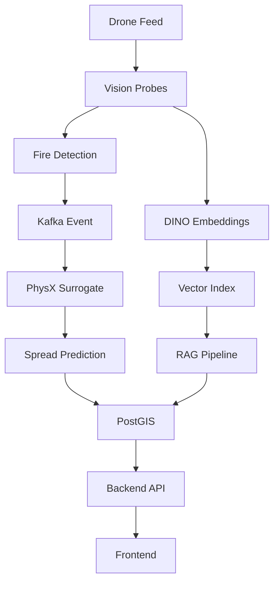

# GUIRA Integration Guide - PhysX & DINO v3

## Table of Contents
- [Overview](#overview)
- [Prerequisites](#prerequisites)
- [PhysX Fire Spread Integration](#physx-fire-spread-integration)
- [DINO v3 Embedding Integration](#dino-v3-embedding-integration)
- [Complete System Integration](#complete-system-integration)
- [API Reference](#api-reference)
- [Troubleshooting](#troubleshooting)

---

## Overview

This guide provides step-by-step instructions for integrating and using the PhysX fire spread simulation and DINO v3 vision embedding components within the GUIRA fire detection system.

**Integration Points:**
1. **PhysX Surrogate Model** - Real-time fire spread predictions (100-1000× faster than physics simulation)
2. **DINO v3 Embedding Service** - Visual feature extraction for RAG and search
3. **Data Ingestion Pipeline** - Kafka-based event streaming
4. **Geospatial Processing** - PostGIS for location-aware analysis

---

## Prerequisites

### System Requirements

| Component | Minimum | Recommended |
|-----------|---------|-------------|
| **CPU** | 4 cores | 8+ cores |
| **RAM** | 16 GB | 32+ GB |
| **GPU** | CUDA-capable (4GB VRAM) | NVIDIA RTX 3080+ (10GB VRAM) |
| **Storage** | 50 GB | 100+ GB SSD |
| **OS** | Ubuntu 20.04+ | Ubuntu 22.04 |

### Software Dependencies

```bash
# Python 3.10+
python --version

# CUDA 11.8+ (for GPU acceleration)
nvcc --version

# Docker & Docker Compose (for local infrastructure)
docker --version
docker-compose --version
```

### Python Packages

```bash
# Install from requirements.txt
pip install -r requirements.txt

# Key packages:
# - torch>=2.0.0
# - transformers>=4.30.0
# - ultralytics>=8.0.0
# - fastapi>=0.100.0
# - kafka-python>=2.0.0
# - psycopg2-binary>=2.9.0
# - rasterio>=1.3.0
```

---

## PhysX Fire Spread Integration

### Step 1: Setup PhysX Infrastructure

#### Option A: Use Mock PhysX Runner (Development)

```bash
cd integrations/guira_core/orchestrator/surrogate

# Generate synthetic dataset using mock PhysX
python generate_ensemble.py \
    --output-dir physx_dataset \
    --num-runs 1000 \
    --grid-size 64 \
    --use-mock
```

**Mock Runner Features:**
- No C++ PhysX server required
- Generates synthetic fire spread data
- Suitable for development and testing
- Fast dataset generation (~10 min for 1000 runs)

#### Option B: Use Real PhysX Server (Production)

```bash
cd integrations/guira_core/simulation/physx_server

# Build PhysX server (requires PhysX SDK)
mkdir build && cd build
cmake ..
make -j8

# Start PhysX gRPC server
./physx_server --port 50051
```

**PhysX Server Requirements:**
- NVIDIA PhysX SDK 5.x
- CMake 3.16+
- C++17 compiler
- gRPC libraries

### Step 2: Generate Training Dataset

```bash
cd integrations/guira_core/orchestrator/surrogate

# Generate PhysX ensemble dataset
python generate_ensemble.py \
    --output-dir physx_dataset \
    --num-runs 1000 \
    --timesteps 10 \
    --grid-size 64 \
    --wind-range 0 20 \
    --humidity-range 0.1 0.9 \
    --physx-server localhost:50051

# Build train/val/test splits
python dataset_builder.py \
    --input-dir physx_dataset/raw \
    --output-dir physx_dataset \
    --split-ratio 0.7 0.15 0.15 \
    --grid-size 64
```

**Dataset Structure:**
```
physx_dataset/
├── samples/
│   ├── run_0000_t000.npz  # Input + targets
│   ├── run_0000_t001.npz
│   └── ...
├── metadata/
│   ├── train.json         # 70% training
│   ├── val.json          # 15% validation
│   └── test.json         # 15% test
└── dataset_info.json
```

### Step 3: Train FireSpreadNet Surrogate

```bash
cd integrations/guira_core/orchestrator/surrogate

# Train full model
python train.py \
    --data-dir physx_dataset \
    --epochs 50 \
    --batch-size 8 \
    --lr 1e-3 \
    --exp-name physx-surrogate-full \
    --model-type full \
    --save-dir models

# Or train lite model (faster, less accurate)
python train.py \
    --data-dir physx_dataset \
    --epochs 30 \
    --batch-size 16 \
    --lr 1e-3 \
    --exp-name physx-surrogate-lite \
    --model-type lite \
    --save-dir models
```

**Training Outputs:**
- Model checkpoint: `models/fire_spreadnet.pt`
- MLflow tracking: http://localhost:5000
- Training logs: `logs/training.log`

### Step 4: Evaluate Surrogate Model

```bash
cd integrations/guira_core/orchestrator/surrogate

# Run evaluation on test set
python evaluate.py \
    --model-path models/fire_spreadnet.pt \
    --data-dir physx_dataset \
    --split test \
    --output-dir eval_results

# Metrics will include:
# - MSE (intensity): target < 0.10
# - BCE (ignition): target < 0.5
# - Brier score: target < 0.25
# - IoU (ignition): target > 0.5
```

### Step 5: Integrate with Backend API

```python
# integrations/guira_core/orchestrator/api/app.py

from fastapi import FastAPI
from surrogate import PhysXSurrogate
import numpy as np

app = FastAPI()

# Load surrogate model at startup
surrogate = PhysXSurrogate(model_path="surrogate/models/fire_spreadnet.pt")

@app.post("/api/surrogate/predict")
async def predict_fire_spread(request: FireSpreadRequest):
    """
    Predict fire spread using PhysX surrogate model.
    
    Request body:
    {
        "fire_t0": [[...], [...]], // Current fire state (H x W)
        "wind_u": [[...], [...]],  // Wind u-component
        "wind_v": [[...], [...]],  // Wind v-component
        "humidity": [[...], [...]],
        "fuel": [[...], [...]],
        "slope": [[...], [...]]
    }
    """
    # Convert to numpy arrays
    fire_t0 = np.array(request.fire_t0)
    wind_u = np.array(request.wind_u)
    wind_v = np.array(request.wind_v)
    humidity = np.array(request.humidity)
    fuel = np.array(request.fuel)
    slope = np.array(request.slope)
    
    # Predict fire spread
    prediction = surrogate.predict_fire_spread(
        fire_t0, wind_u, wind_v, humidity, fuel, slope
    )
    
    return {
        "ignition_prob": prediction['ignition'].tolist(),
        "intensity": prediction['intensity'].tolist(),
        "inference_time_ms": prediction['inference_time'] * 1000
    }
```

### Step 6: Example Usage

```python
# example_usage.py

import requests
import numpy as np

# Create sample fire scenario
H, W = 64, 64
fire_t0 = np.zeros((H, W))
fire_t0[30:35, 30:35] = 1.0  # Initial fire

wind_u = np.full((H, W), 5.0)   # 5 m/s east wind
wind_v = np.full((H, W), 0.0)
humidity = np.full((H, W), 0.3)
fuel = np.random.uniform(0.5, 1.0, (H, W))
slope = np.random.uniform(0, 15, (H, W))

# Call API
response = requests.post(
    "http://localhost:8000/api/surrogate/predict",
    json={
        "fire_t0": fire_t0.tolist(),
        "wind_u": wind_u.tolist(),
        "wind_v": wind_v.tolist(),
        "humidity": humidity.tolist(),
        "fuel": fuel.tolist(),
        "slope": slope.tolist()
    }
)

result = response.json()
print(f"Inference time: {result['inference_time_ms']:.2f} ms")
print(f"Max ignition probability: {np.max(result['ignition_prob']):.3f}")
```

---

## DINO v3 Embedding Integration

### Step 1: Setup DINO Embedding Service

```bash
cd integrations/guira_core/vision/embed_service

# Install dependencies
pip install -r requirements.txt

# Download DINO model (auto-downloads on first use)
# Models: facebook/dinov2-base (768-dim) or facebook/dinov2-large (1024-dim)

# Start service
uvicorn app:app --host 0.0.0.0 --port 8002 --reload
```

### Step 2: Configure Storage Backend

#### MinIO Setup (Local Development)

```bash
# Start MinIO using Docker
docker run -d \
  -p 9000:9000 \
  -p 9001:9001 \
  --name minio \
  -e "MINIO_ROOT_USER=minioadmin" \
  -e "MINIO_ROOT_PASSWORD=minioadmin" \
  quay.io/minio/minio server /data --console-address ":9001"

# Create bucket
docker exec minio mc alias set local http://localhost:9000 minioadmin minioadmin
docker exec minio mc mb local/embeds
```

#### Azure Blob Storage (Production)

```bash
# Set environment variables
export AZURE_STORAGE_ACCOUNT=<your-account>
export AZURE_STORAGE_KEY=<your-key>
export EMBED_BUCKET=embeds
export USE_MINIO=false
```

### Step 3: Configure Vector Search

#### Azure AI Search Setup

```bash
# Create search service (via Azure Portal or CLI)
az search service create \
  --name guira-search \
  --resource-group guira-rg \
  --sku standard

# Set environment variables
export AZURE_SEARCH_ENDPOINT=https://guira-search.search.windows.net
export AZURE_SEARCH_KEY=<your-admin-key>
```

**Index Schema:**
```json
{
  "name": "fire-embeddings",
  "fields": [
    {"name": "id", "type": "Edm.String", "key": true},
    {"name": "embedding", "type": "Collection(Edm.Single)", "dimensions": 768, "vectorSearchProfile": "default"},
    {"name": "session_id", "type": "Edm.String", "filterable": true},
    {"name": "timestamp", "type": "Edm.DateTimeOffset", "sortable": true},
    {"name": "location", "type": "Edm.GeographyPoint", "filterable": true},
    {"name": "metadata", "type": "Edm.String"}
  ],
  "vectorSearch": {
    "algorithms": [
      {"name": "hnsw", "kind": "hnsw", "hnswParameters": {"m": 4, "efConstruction": 400}}
    ],
    "profiles": [
      {"name": "default", "algorithm": "hnsw"}
    ]
  }
}
```

### Step 4: Extract Embeddings

#### Python API

```python
from embed_service.app import DINOEmbedder
from PIL import Image

# Initialize embedder
embedder = DINOEmbedder(model_id="facebook/dinov2-base")

# Load image
image = Image.open("drone_image.jpg")

# Extract embedding
result = embedder.embed_image(
    image=image,
    store=True,
    metadata={"session_id": "session_123", "timestamp": "2025-01-01T12:00:00Z"}
)

print(f"Embedding ID: {result['embedding_id']}")
print(f"Shape: {result['shape']}")
print(f"Blob URL: {result['blob_url']}")
```

#### REST API

```bash
# Embed single image
curl -X POST http://localhost:8002/embed \
  -F "file=@drone_image.jpg" \
  -F "store=true" \
  -F "metadata={\"session_id\": \"session_123\"}"

# Response
{
  "embedding_id": "550e8400-e29b-41d4-a716-446655440000",
  "shape": [768],
  "num_tiles": 1,
  "blob_url": "s3://embeds/550e8400-e29b-41d4-a716-446655440000.npy",
  "indexed": true
}
```

### Step 5: Integrate with RAG Pipeline

```python
# rag_pipeline.py

from azure.search.documents import SearchClient
from azure.core.credentials import AzureKeyCredential
import openai

# Setup search client
search_client = SearchClient(
    endpoint=AZURE_SEARCH_ENDPOINT,
    index_name="fire-embeddings",
    credential=AzureKeyCredential(AZURE_SEARCH_KEY)
)

# Setup OpenAI
openai.api_type = "azure"
openai.api_key = AZURE_OPENAI_KEY
openai.api_base = AZURE_OPENAI_ENDPOINT

async def query_rag(query_text: str, top_k: int = 5):
    """
    Query RAG system using semantic search + LLM.
    """
    # 1. Generate query embedding
    query_embedding = await embedder.embed_text(query_text)
    
    # 2. Vector search for similar images
    results = search_client.search(
        search_text=None,
        vector_queries=[{
            "vector": query_embedding,
            "k_nearest_neighbors": top_k,
            "fields": "embedding"
        }]
    )
    
    # 3. Retrieve context from top results
    contexts = []
    for result in results:
        metadata = json.loads(result['metadata'])
        contexts.append(f"Image from {metadata['timestamp']}: {metadata['description']}")
    
    # 4. Assemble prompt
    prompt = f"""
    Based on these fire detection observations:
    
    {chr(10).join(contexts)}
    
    Answer this question: {query_text}
    """
    
    # 5. Call LLM
    response = openai.ChatCompletion.create(
        deployment_name="gpt-4",
        messages=[
            {"role": "system", "content": "You are a wildfire analysis expert."},
            {"role": "user", "content": prompt}
        ]
    )
    
    return response.choices[0].message.content
```

### Step 6: Example RAG Queries

```python
# Query examples

# 1. Visual search
result = await query_rag("Show me all images with active fires near water sources")

# 2. Temporal analysis
result = await query_rag("How has the fire spread over the last 2 hours?")

# 3. Contextual understanding
result = await query_rag("What vegetation types are in the fire perimeter?")

# 4. Anomaly detection
result = await query_rag("Are there any unusual smoke patterns?")
```

---

## Complete System Integration

### Architecture Overview



### Step 1: Start Infrastructure

```bash
cd integrations/guira_core/infra

# Start all services (Kafka, PostgreSQL, MinIO)
./local_start.sh

# Verify services
docker-compose ps
```

### Step 2: Initialize Database

```bash
cd integrations/guira_core/infra/sql

# Run initialization script
./setup_database.sh

# Verify PostGIS extension
psql -h localhost -U guira -d guira_db -c "SELECT PostGIS_Version();"
```

### Step 3: Start Backend Services

```bash
# Terminal 1: Backend API
cd integrations/guira_core/orchestrator/api
uvicorn app:app --host 0.0.0.0 --port 8000 --reload

# Terminal 2: DINO Embedding Service
cd integrations/guira_core/vision/embed_service
uvicorn app:app --host 0.0.0.0 --port 8002 --reload

# Terminal 3: YOLO Fire Probe
cd integrations/guira_core/vision/probes/yolo_probe
uvicorn app:app --host 0.0.0.0 --port 8003 --reload
```

### Step 4: Start Frontend

```bash
cd integrations/guira_core/frontend

# Install dependencies
npm install

# Start dev server
npm run dev

# Access at http://localhost:5173
```

### Step 5: Test End-to-End Flow

```python
# test_e2e.py

import requests
from PIL import Image
import numpy as np

# 1. Upload image to YOLO probe
with open("test_fire.jpg", "rb") as f:
    yolo_response = requests.post(
        "http://localhost:8003/detect",
        files={"file": f}
    )

detections = yolo_response.json()
print(f"Detected {len(detections['boxes'])} fires")

# 2. If fire detected, trigger PhysX surrogate
if detections['boxes']:
    # Get fire location and create scenario
    fire_box = detections['boxes'][0]
    
    # Create fire grid
    H, W = 64, 64
    fire_t0 = np.zeros((H, W))
    fire_t0[30:35, 30:35] = 1.0
    
    # Predict spread
    spread_response = requests.post(
        "http://localhost:8000/api/surrogate/predict",
        json={
            "fire_t0": fire_t0.tolist(),
            "wind_u": np.full((H, W), 5.0).tolist(),
            "wind_v": np.zeros((H, W)).tolist(),
            "humidity": np.full((H, W), 0.3).tolist(),
            "fuel": np.full((H, W), 0.8).tolist(),
            "slope": np.zeros((H, W)).tolist()
        }
    )
    
    prediction = spread_response.json()
    print(f"Spread prediction completed in {prediction['inference_time_ms']:.2f}ms")

# 3. Extract DINO embedding
with open("test_fire.jpg", "rb") as f:
    embed_response = requests.post(
        "http://localhost:8002/embed",
        files={"file": f},
        data={"store": "true", "metadata": '{"session_id": "test_123"}'}
    )

embedding = embed_response.json()
print(f"Embedding extracted: {embedding['embedding_id']}")
```

---

## API Reference

### PhysX Surrogate API

#### POST /api/surrogate/predict

**Request:**
```json
{
  "fire_t0": [[float]],    // (H, W) fire state
  "wind_u": [[float]],     // (H, W) wind u-component (m/s)
  "wind_v": [[float]],     // (H, W) wind v-component (m/s)
  "humidity": [[float]],   // (H, W) relative humidity [0-1]
  "fuel": [[float]],       // (H, W) fuel density [0-1]
  "slope": [[float]]       // (H, W) slope (degrees)
}
```

**Response:**
```json
{
  "ignition_prob": [[float]],      // (H, W) ignition probability [0-1]
  "intensity": [[float]],          // (H, W) fire intensity
  "inference_time_ms": float
}
```

### DINO Embedding API

#### POST /embed

**Request (multipart/form-data):**
- `file`: Image file (JPEG/PNG)
- `store`: Boolean (optional, default=false)
- `metadata`: JSON string (optional)

**Response:**
```json
{
  "embedding_id": "uuid",
  "shape": [768],
  "num_tiles": int,
  "blob_url": "s3://embeds/uuid.npy",
  "indexed": boolean
}
```

#### GET /embed/{embedding_id}

**Response:**
```json
{
  "embedding_id": "uuid",
  "embedding": [float],  // 768-dim vector
  "metadata": {...}
}
```

### RAG Query API

#### POST /api/query

**Request:**
```json
{
  "query": "string",
  "top_k": 5,
  "filters": {
    "session_id": "string",
    "start_time": "ISO8601",
    "end_time": "ISO8601"
  }
}
```

**Response:**
```json
{
  "answer": "string",
  "sources": [
    {
      "image_id": "uuid",
      "timestamp": "ISO8601",
      "similarity": float
    }
  ]
}
```

---

## Troubleshooting

### PhysX Issues

**Problem:** Training loss not decreasing

**Solutions:**
- Check dataset quality (ensure PhysX simulations converged)
- Reduce learning rate to 1e-4
- Increase batch size if GPU memory allows
- Verify data normalization

**Problem:** Inference time > 100ms

**Solutions:**
- Use smaller grid size (32×32 instead of 64×64)
- Switch to lite model
- Enable FP16 inference: `model.half()`
- Use TensorRT optimization

### DINO Issues

**Problem:** Out of GPU memory

**Solutions:**
- Reduce tile size to 256×256
- Process images on CPU: `export CUDA_VISIBLE_DEVICES=""`
- Use smaller model: `facebook/dinov2-small`

**Problem:** Embeddings not indexed in Azure AI Search

**Solutions:**
- Verify search service credentials
- Check index schema matches embedding dimensions
- Ensure network connectivity to Azure
- Review service logs for errors

### Integration Issues

**Problem:** Kafka connection refused

**Solutions:**
```bash
# Restart Kafka
cd integrations/guira_core/infra
docker-compose restart kafka

# Verify Kafka is running
docker-compose ps kafka
```

**Problem:** PostGIS queries failing

**Solutions:**
```bash
# Verify PostGIS extension
psql -h localhost -U guira -d guira_db -c "SELECT PostGIS_Version();"

# Recreate database if needed
cd integrations/guira_core/infra/sql
./setup_database.sh --force
```

---

## Performance Tuning

### PhysX Surrogate

```python
# Enable mixed precision training
from torch.cuda.amp import autocast, GradScaler

scaler = GradScaler()

for batch in dataloader:
    with autocast():
        outputs = model(inputs)
        loss = criterion(outputs, targets)
    
    scaler.scale(loss).backward()
    scaler.step(optimizer)
    scaler.update()
```

### DINO Embeddings

```python
# Batch processing for multiple images
embeddings = embedder.embed_batch(
    images=[img1, img2, img3],
    batch_size=8
)
```

### Database Optimization

```sql
-- Create spatial index for fire locations
CREATE INDEX fire_locations_gix ON fire_detections USING GIST (location);

-- Create time-series index
CREATE INDEX fire_detections_timestamp_idx ON fire_detections (timestamp DESC);
```

---

## Next Steps

1. **Explore Advanced Features:**
   - Multi-step fire spread predictions
   - Ensemble predictions with uncertainty
   - Real-time stream processing

2. **Deploy to Production:**
   - Follow [DEPLOYMENT.md](./docs/DEPLOYMENT.md)
   - Setup monitoring and alerting
   - Configure auto-scaling

3. **Extend Functionality:**
   - Fine-tune DINO on fire-specific imagery
   - Train PhysX surrogate on local terrain data
   - Integrate weather API for real-time conditions

---

## Support & Resources

- **Documentation:** [docs/](./docs/)
- **API Specs:** [Functionality_PhysX_DINOv3.md](./Functionality_PhysX_DINOv3.md)
- **Issues:** [GitHub Issues](https://github.com/THEDIFY/FIREPREVENTION/issues)
- **Discussions:** [GitHub Discussions](https://github.com/THEDIFY/FIREPREVENTION/discussions)
