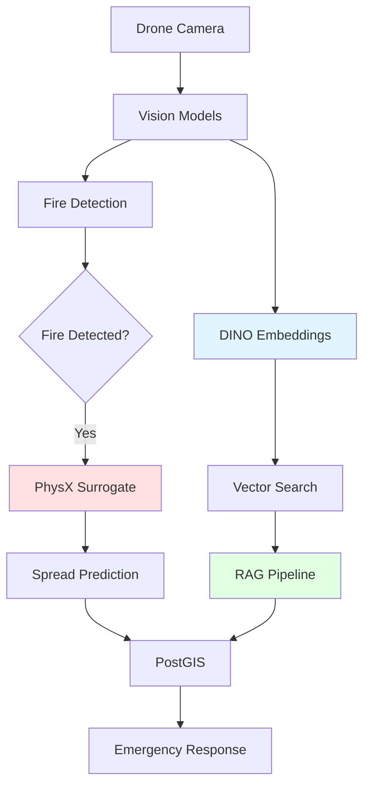

# GUIRA Fire Detection System

**Geospatial Understanding & Intelligence for Rapid Assessment**

An advanced AI-powered wildfire detection and prevention system integrating:
- **PhysX Fire Spread Simulation** - 100-1000× faster predictions via neural surrogate modeling
- **DINO v3 Vision Embeddings** - Self-supervised visual features for RAG pipelines
- **Multi-modal AI Detection** - YOLOv8, TimeSFormer, ResNet50, CSRNet
- **Real-time Data Ingestion** - Kafka, PostgreSQL/PostGIS, Azure AI Search
- **Geospatial Intelligence** - Camera projection, DEM integration, live mapping

---

## 📚 Documentation

| Document | Description |
|----------|-------------|
| **[QUICKSTART.md](./QUICKSTART.md)** ⚡ | Essential commands and quick reference |
| **[ARCHITECTURE.md](./ARCHITECTURE.md)** 🏗️ | System architecture with Mermaid diagrams |
| **[INTEGRATION_GUIDE.md](./INTEGRATION_GUIDE.md)** 🔧 | Step-by-step PhysX & DINO v3 setup |
| **[COMPONENT_REFERENCE.md](./COMPONENT_REFERENCE.md)** 📖 | Detailed API and component docs |
| **[docs/DEPLOYMENT.md](./docs/DEPLOYMENT.md)** 🚀 | Production deployment guide |
| **[Functionality_PhysX_DINOv3.md](./Functionality_PhysX_DINOv3.md)** 🔬 | Advanced technical specifications |

---

## 🚀 Quick Start

```bash
# Clone repository
git clone https://github.com/THEDIFY/FIREPREVENTION.git
cd FIREPREVENTION

# Install dependencies
pip install -r requirements.txt

# Start local infrastructure
cd integrations/guira_core/infra
./local_start.sh

# Start backend services
cd ../orchestrator/api
uvicorn app:app --host 0.0.0.0 --port 8000
```

**📖 Documentation:**
- **[ARCHITECTURE.md](./ARCHITECTURE.md)** - System architecture with Mermaid diagrams
- **[INTEGRATION_GUIDE.md](./INTEGRATION_GUIDE.md)** - Step-by-step PhysX & DINO v3 setup
- **[COMPONENT_REFERENCE.md](./COMPONENT_REFERENCE.md)** - Detailed component documentation
- **[Functionality_PhysX_DINOv3.md](./Functionality_PhysX_DINOv3.md)** - Advanced technical specifications

---

## 🏗️ System Overview

### Core Capabilities

1. **PhysX Fire Spread Simulation**
   - Neural surrogate model (FireSpreadNet) trained on PhysX simulations
   - Real-time predictions: 30-50ms (vs 5-50 seconds for full physics)
   - Accuracy: ~95% vs PhysX ground truth
   - U-Net architecture with dual output heads (ignition + intensity)

2. **DINO v3 Vision Embeddings**
   - Self-supervised visual feature extraction (facebook/dinov2-base)
   - 768-dimensional embeddings for RAG and visual search
   - Automatic tiling for large images (518×518 patches)
   - Azure AI Search integration for semantic retrieval

3. **Multi-modal Detection Pipeline**
   - Fire/Smoke: YOLOv8 + TimeSFormer
   - Wildlife: YOLOv8 + CSRNet (density estimation)
   - Vegetation: ResNet50 + VARI index
   - Geospatial projection with DEM integration

4. **Real-time Data Platform**
   - Kafka event streaming
   - PostgreSQL/PostGIS for geospatial storage
   - Azure AI Search for vector embeddings
   - MinIO/Azure Blob for object storage


---

## 📊 Architecture Diagrams

### High-Level System Flow



**See [ARCHITECTURE.md](./ARCHITECTURE.md) for detailed architecture diagrams with Mermaid.**

---

## 📁 Directory Structure


```
FIREPREVENTION/
├── ARCHITECTURE.md              # 📖 System architecture with diagrams
├── INTEGRATION_GUIDE.md         # 🔧 PhysX & DINO v3 integration guide
├── COMPONENT_REFERENCE.md       # 📚 Detailed component documentation
├── Functionality_PhysX_DINOv3.md # 🔬 Advanced technical specifications
├── 
├── config.yaml                  # Main configuration file
├── requirements.txt             # Python dependencies
├── 
├── # Core Training Scripts
├── train_fire.py                # Train fire detection model
├── train_smoke.py               # Train smoke detection model
├── train_fauna.py               # Train fauna detection model
├── train_veg.py                 # Train vegetation health model
├── simulate_spread.py           # Train fire spread model
├── run_pipeline.py              # Main pipeline orchestration
├── cli.py                       # Command line interface
├── 
├── # Detection Models (Legacy)
├── src/
│   ├── fire/                    # Fire detection (YOLOv8)
│   ├── smoke/                   # Smoke detection (TimeSFormer)
│   ├── fauna/                   # Wildlife detection
│   ├── vegetation/              # Vegetation health
│   ├── geospatial/              # Geospatial projection
│   └── spread/                  # Fire spread simulation
├── 
├── # GUIRA Core Integration (Primary)
├── integrations/guira_core/
│   ├── vision/
│   │   ├── embed_service/       # 🔷 DINO v3 Embedding Service
│   │   └── probes/
│   │       ├── yolo_probe/      # Fire detection probe
│   │       └── timesformer_probe/ # Smoke detection probe
│   ├── orchestrator/
│   │   ├── api/                 # 🌐 Backend FastAPI
│   │   └── surrogate/           # 🔥 PhysX Fire Spread Surrogate
│   │       ├── models.py        # FireSpreadNet architecture
│   │       ├── train.py         # Training pipeline
│   │       ├── dataset_builder.py # Dataset generation
│   │       └── evaluate.py      # Model evaluation
│   ├── simulation/
│   │   └── physx_server/        # ⚙️ PhysX C++ Server
│   ├── data/ingest/             # Kafka ingestion
│   ├── frontend/                # React + TypeScript UI
│   └── infra/                   # Infrastructure (Docker, Bicep)
├── 
├── # Data & Models
├── data/                        # Training datasets
├── models/                      # Trained model checkpoints
├── tests/                       # Unit & integration tests
└── outputs/                     # Inference results
```


---

## 🔥 PhysX Fire Spread Integration

**Key Features:**
- **100-1000× speedup** over full PhysX simulation
- **~95% accuracy** compared to physics ground truth
- **30-50ms inference** on GPU for real-time predictions
- **U-Net architecture** with dual output heads (ignition probability + fire intensity)

**Quick Start:**
```bash
cd integrations/guira_core/orchestrator/surrogate

# Generate training dataset (mock PhysX)
python generate_ensemble.py --num-runs 1000 --use-mock

# Train surrogate model
python train.py --data-dir physx_dataset --epochs 50

# Evaluate model
python evaluate.py --model-path models/fire_spreadnet.pt
```

**See [INTEGRATION_GUIDE.md](./INTEGRATION_GUIDE.md#physx-fire-spread-integration) for detailed setup.**

---

## 🔷 DINO v3 Embedding Integration

**Key Features:**
- **Self-supervised learning** from facebook/dinov2-base
- **768-dimensional embeddings** for semantic visual search
- **Automatic image tiling** (518×518 patches with 50% overlap)
- **RAG integration** with Azure AI Search

**Quick Start:**
```bash
cd integrations/guira_core/vision/embed_service

# Start DINO embedding service
uvicorn app:app --host 0.0.0.0 --port 8002

# Extract embeddings via API
curl -X POST http://localhost:8002/embed \
  -F "file=@fire_image.jpg" \
  -F "store=true"
```

**See [INTEGRATION_GUIDE.md](./INTEGRATION_GUIDE.md#dino-v3-embedding-integration) for detailed setup.**

---

## 🛠️ Installation


### Prerequisites

| Component | Minimum | Recommended |
|-----------|---------|-------------|
| **Python** | 3.10+ | 3.11+ |
| **GPU** | CUDA 11.8+ (4GB VRAM) | NVIDIA RTX 3080+ (10GB VRAM) |
| **RAM** | 16 GB | 32+ GB |
| **Storage** | 50 GB | 100+ GB SSD |
| **OS** | Ubuntu 20.04+ | Ubuntu 22.04 |

### Quick Setup

```bash
# 1. Clone repository
git clone https://github.com/THEDIFY/FIREPREVENTION.git
cd FIREPREVENTION

# 2. Create virtual environment
python -m venv venv
source venv/bin/activate  # Linux/Mac
# or .\venv\Scripts\activate  # Windows

# 3. Install dependencies
pip install -r requirements.txt

# 4. Start infrastructure (Docker required)
cd integrations/guira_core/infra
./local_start.sh

# 5. Start backend API
cd ../orchestrator/api
uvicorn app:app --host 0.0.0.0 --port 8000 &

# 6. Start DINO embedding service
cd ../../vision/embed_service
uvicorn app:app --host 0.0.0.0 --port 8002 &

# 7. Start frontend
cd ../../frontend
npm install && npm run dev
```

**Access:**
- Frontend: http://localhost:5173
- Backend API: http://localhost:8000/docs
- DINO API: http://localhost:8002/docs

---

## ⚙️ Configuration

Edit `config.yaml` to customize the system:

### Key Configuration Sections

- **fire**: Fire detection model parameters
- **smoke**: Smoke detection model parameters  
- **fauna**: Fauna detection model parameters
- **vegetation**: Vegetation health model parameters
- **geospatial**: Geospatial projection settings
- **spread**: Fire spread simulation parameters
- **pipeline**: Main pipeline configuration

### Camera Calibration

Update `config/intrinsics.json` with your camera's intrinsic parameters:

```json
{
  "fx": 800.0,
  "fy": 800.0, 
  "cx": 320.0,
  "cy": 240.0,
  "resolution": {
    "width": 640,
    "height": 480
  }
}
```

## Usage

### Command Line Interface

The system provides a unified CLI for all operations:

```powershell
# Show system status
python cli.py status

# Download datasets
python cli.py download --dataset all

# Train all models
python cli.py train --model all --epochs 50

# Run inference on single model
python cli.py infer fire --input image.jpg --output results/

# Run complete pipeline
python cli.py pipeline --input 0 --max-frames 1000

# Test system
python cli.py test --type all

# Monitor system health
python monitor.py --mode health

# Run performance benchmarks
python benchmark.py --category all --output benchmarks/
```

### Training Models

Train individual models using the provided scripts:

```powershell
# Train fire detection model
python train_fire.py --config config.yaml --epochs 50

# Train smoke detection model  
python train_smoke.py --config config.yaml --epochs 30

# Train fauna detection model
python train_fauna.py --config config.yaml --epochs 40

# Train vegetation health model
python train_veg.py --config config.yaml --epochs 35

# Train fire spread simulation model
python simulate_spread.py --config config.yaml --epochs 50
```

### System Testing and Validation

```powershell
# Run comprehensive test suite
python test_system.py --test-type all --verbose

# Run specific test categories
python test_system.py --test-type unit
python test_system.py --test-type integration
python test_system.py --test-type performance

# Run system health check
python monitor.py --mode health

# Continuous system monitoring
python monitor.py --mode continuous --interval 10 --duration 300

# Performance benchmarking
python benchmark.py --category all --output benchmarks/
python benchmark.py --category image_processing --verbose
```

### Dataset Management

```powershell
# Download all datasets
python download_datasets.py --dataset all

# Download specific dataset
python download_datasets.py --dataset fire

# Verify dataset structure
python download_datasets.py --verify-only
```

### Running the Pipeline

#### Process Live Camera Feed
```powershell
python run_pipeline.py --mode process_frames --input 0
```

#### Process Video File
```powershell
python run_pipeline.py --mode process_video --input path/to/video.mp4
```

#### Process Network Stream
```powershell
python run_pipeline.py --mode process_frames --input rtmp://localhost/live/stream
```

#### Advanced Options
```powershell
python run_pipeline.py \
  --config config.yaml \
  --mode process_frames \
  --input 0 \
  --max_frames 1000 \
  --output_dir outputs/test_run
```

### Individual Model Inference

#### Fire Detection
```powershell
cd src/fire
python fire_detection.py --mode infer --input image.jpg --output outputs/fire
```

#### Smoke Detection  
```powershell
cd src/smoke
python smoke_detection.py --mode infer --input video.mp4 --output outputs/smoke.csv
```

#### Fauna Detection
```powershell
cd src/fauna
python fauna_detection.py --mode infer --input image.jpg --output outputs/fauna
```

#### Vegetation Health
```powershell
cd src/vegetation
python vegetation_health.py --mode infer --input image.jpg --output outputs/vegetation.png
```

#### Fire Spread Simulation
```powershell
cd src/spread
python fire_spread_simulation.py --mode simulate --steps 100 --output outputs/spread
```

## Data Formats

### Fire Detection Data
- **Images**: `.jpg`, `.png` files
- **Labels**: YOLO format `.txt` files with `<class> <x_center> <y_center> <width> <height>` (normalized)

### Smoke Detection Data
- **Videos**: `.mp4` files
- **Annotations**: CSV with columns `video_name,frame_index,smoke_flag`

### Fauna Detection Data
- **Images**: `.jpg` files
- **Annotations**: COCO format JSON with additional `health` and `species` fields

### Vegetation Health Data
- **Images**: `.jpg`, `.tif` files  
- **Masks**: `.png` files with pixel values 0=healthy, 1=dry, 2=burned

### Pose Data
CSV file with columns: `frame,lat,lon,alt,yaw,pitch,roll`

## Output Formats

### Detection Results
JSON files with detection bounding boxes, confidence scores, and class labels:

```json
[{
  "x1": 100, "y1": 100, "x2": 200, "y2": 200,
  "score": 0.85, "class": "fire"
}]
```

### Geospatial Results
GeoJSON files with world coordinates:

```json
{
  "type": "FeatureCollection",
  "features": [{
    "type": "Feature", 
    "geometry": {"type": "Point", "coordinates": [-74.006, 40.7128]},
    "properties": {"class": "fire", "confidence": 0.85}
  }]
}
```

### Fire Spread Simulation
- GeoJSON files for each timestep
- Animated GIF visualization
- CSV timeline data

## Model Architecture Details

### Fire Detection (YOLOv8)
- **Backbone**: CSPDarknet with PANet
- **Loss**: CIoU + BCE + objectness
- **Augmentations**: Mosaic, HSV jitter, scale/rotate
- **Classes**: fire, smoke

### Smoke Detection (TimeSFormer)
- **Architecture**: Vision Transformer with temporal attention
- **Input**: 8-frame sequences
- **Patch size**: 16x16
- **Output**: Binary smoke classification

### Fauna Detection (YOLOv8 + CSRNet)
- **Detection**: YOLOv8 with health classification head
- **Density**: CSRNet with VGG backbone
- **Species**: deer, elk, bear, bird, other
- **Health**: healthy, distressed

### Vegetation Health (ResNet50 + VARI)
- **Backbone**: ResNet50 with 4-channel input (RGB + VARI)
- **VARI**: (Green - Red) / (Green + Red - Blue)
- **Classes**: healthy, dry, burned

### Fire Spread Simulation
- **Neural**: CNN-based dynamics learning
- **Physics**: Wind, slope, humidity, vegetation factors
- **Grid**: 256x256 cells, 30m resolution

## Performance Optimization

### GPU Memory Optimization
- Use mixed precision training: `use_mixed_precision: true`
- Adjust batch sizes based on GPU memory
- Enable model checkpointing for large models

### CPU Optimization  
- Set appropriate number of workers: `workers: 4`
- Use batch processing for multiple images
- Enable frame caching: `cache_size: 1000`

### Real-time Processing
- Process every N frames: `frame_interval: 30`
- Use background threads for I/O
- Enable GPU acceleration for inference

## Monitoring and Logging

The system provides comprehensive logging:

- **Console output**: Real-time processing status
- **Log files**: Detailed operation logs in `logs/`
- **Metrics**: Detection counts, processing times, risk scores
- **Visualizations**: Annotated frames (if enabled)

## Troubleshooting

### Common Issues

1. **CUDA out of memory**
   - Reduce batch sizes in config
   - Enable mixed precision
   - Use smaller model variants
   - Check GPU memory with: `python monitor.py --mode monitor`

2. **Video stream connection failed**
   - Check network connectivity
   - Verify stream URL format
   - Test with local video file first
   - Use: `python cli.py pipeline --input path/to/video.mp4`

3. **Model loading errors**
   - Ensure model files exist: `python cli.py status`
   - Train models: `python cli.py train --model all`
   - Check file permissions
   - Verify model compatibility

4. **Geospatial projection errors**
   - Verify pose data format
   - Check DEM file availability: `python download_datasets.py --verify-only`
   - Ensure camera intrinsics are correct

5. **Dataset issues**
   - Download datasets: `python cli.py download --dataset all`
   - Verify structure: `python download_datasets.py --verify-only`
   - Check data directory permissions

6. **Performance issues**
   - Run benchmarks: `python benchmark.py --category all`
   - Monitor system: `python monitor.py --mode continuous`
   - Check resource usage with system monitor

7. **Dependency issues**
   - Check system status: `python cli.py status`
   - Reinstall requirements: `pip install -r requirements.txt`
   - Verify CUDA installation for GPU support

### System Health Monitoring

```powershell
# Quick health check
python monitor.py --mode health

# Monitor system resources
python monitor.py --mode monitor

# Continuous monitoring with alerts
python monitor.py --mode continuous --output monitoring.log

# Run system tests
python test_system.py --test-type all
```

### Performance Tuning

- **For accuracy**: Use larger models, more training epochs
- **For speed**: Use smaller models, process fewer frames
- **For memory**: Reduce batch sizes, use gradient checkpointing

## API Integration

The system can be integrated into larger applications:

```python
from src.fire.fire_detection import FireDetectionInference
from utils import load_config

config = load_config('config.yaml')
detector = FireDetectionInference('models/fire_yolov8.pt', config['fire'])

# Process single image
detections = detector.detect(image)
```

### System Monitoring API

```python
from monitor import SystemMonitor

# Initialize monitor
monitor = SystemMonitor('config.yaml')

# Get health summary
health = monitor.get_health_summary()
print(f"System health: {health['overall_health']['status']}")

# Get current metrics
metrics = monitor.get_system_metrics()
print(f"CPU: {metrics['cpu']['usage_percent']:.1f}%")
```

### CLI Integration

```python
from cli import FirePreventionCLI

# Initialize CLI
cli = FirePreventionCLI()
cli.load_config('config.yaml')

# Run training
success = cli.train_models('all', epochs=50)

# Run inference
success = cli.run_inference('fire', 'input.jpg', 'output/')
```

## Contributing

1. Fork the repository
2. Create feature branch: `git checkout -b feature/new-feature`
3. Make changes and test thoroughly
4. Submit pull request with detailed description

## License

This project is licensed under the MIT License - see LICENSE file for details.

## Citation

If you use this system in your research, please cite:

```bibtex
@misc{fire_prevention_system,
  title={AI-Powered Fire Prevention System for Aerial Surveillance},
  author={Your Name},
  year={2025},
  url={https://github.com/your-repo/fire-prevention}
}
```

## Support

For questions, issues, or contributions:
- Create GitHub issues for bugs
- Use discussions for questions
- Check documentation first
- Provide detailed error logs

## Acknowledgments

- YOLO models from Ultralytics  
- TimeSFormer implementation
- Geospatial libraries: GDAL, Rasterio
- Deep learning frameworks: PyTorch, TensorFlow
- Computer vision: OpenCV, Albumentations
